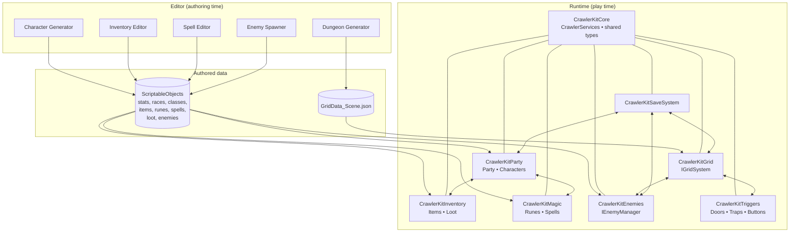

# Architecture

CrawlerKit is built as a set of independent modules that communicate through a lightweight **service locator** (`CrawlerServices`) and shared interfaces, rather than hard references. This keeps each module replaceable and lets you import only the parts you need.

## Module overview



## The modules

| Module | Assembly | Responsibility |
| --- | --- | --- |
| **Core** | `Mantis3de.CrawlerKit.Core` | The `CrawlerServices` service locator, shared enums and value types (`GridPosition`, `Direction`), and the CrawlerKit Hub. Every other module depends on Core and nothing else. |
| **Grid** | `CrawlerKitGrid` | Tile grid, movement, the `IGridSystem` service, and loading the baked `GridData` JSON. Home of the Dungeon Generator. |
| **Party** | `CrawlerKitParty` | Party members, character stats, races and classes. Home of the Character Generator. |
| **Inventory** | `CrawlerKitInventory` | Items, equipment sets, loot tables and rolling. Home of the Inventory Editor. |
| **Magic** | `CrawlerKitMagic` | Runes, spell recipes, effects, VFX and the rune panel. Home of the Spell Editor. |
| **Enemies** | `CrawlerKitEnemies` | Enemy data, instances, the `IEnemyManager` service, and the spawner runtime. Home of the Enemy Spawner. |
| **Triggers** | `CrawlerKitTriggers` | Doors, blockers, traps, buttons and the event wiring between them. |
| **Save System** | `CrawlerKitSaveSystem` | Persisting and restoring party, enemy and grid state. |

## The service locator

Modules don't reference each other directly. Instead they register and resolve services through `CrawlerServices`:

```csharp
// A system registers itself (typically on Awake)
CrawlerServices.Register<IEnemyManager>(this);

// Any other system resolves it without a hard reference
var grid = CrawlerServices.Get<IGridSystem>();
if (grid != null && grid.IsGridReady)
{
    var cell = grid.WorldToGrid(transform.position);
}
```

This is why, for example, the `EnemySpawner` can spawn into the grid and respect the save system without ever holding a direct reference to either — it asks the locator for `IGridSystem`, `IEnemyManager` and the save state at spawn time.

## Editor-to-runtime data flow

CrawlerKit draws a clean line between **authoring time** (the editors) and **play time** (the runtime):

1. **Editors write data.** The Character, Inventory, Spell and Enemy editors produce **ScriptableObject** assets. The Dungeon Generator bakes the entire level into a single **`GridData_<SceneName>.json`** file in a `Resources` folder.
2. **Runtime reads data.** On level start, the Grid system loads the JSON via `Resources.Load`, the PartyUI loads the party member assets, and the other systems resolve their ScriptableObjects. No procedural generation happens at runtime, so there is no generation cost in the shipped game.
3. **The save system snapshots state.** During play, party, enemy and grid state are captured and restored through the Save System, which the spawner and other systems query on load to place entities directly in their saved state.

This separation means your content is fully data-driven and version-control friendly: diffs are readable, assets are reusable, and the runtime stays lean.
