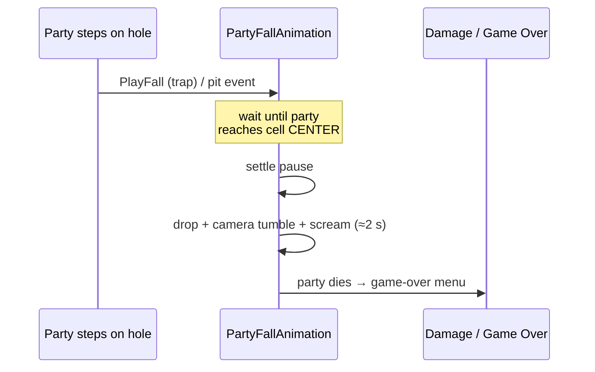

# Party Fall Animation

`PartyFallAnimation` makes the party physically **drop down** when they fall into a hole — a trapdoor or a plain pit — instead of just dying on the spot. The party rig accelerates downward like it's under gravity, the camera tumbles, a scream/fall sound plays, and only **after** the drop has played does the game-over screen appear.

Put the component on the **party root** — the same GameObject as `PartyVisuals`, the one whose child is the player `Camera`. One component covers both managed trapdoors and bare pits.

!!! info "Why the order matters"
    Killing the party calls `PauseGameOver()`, which sets `Time.timeScale = 0` and freezes everything. If the kill happened on the same frame the fall starts, the drop would freeze on frame one. So the **fall plays first, the kill happens on landing.** This is handled for you — see [Timing & game over](#timing-game-over).

---

## Setup

1. Select the **party root** (the GameObject with `PartyVisuals`).
2. **Add Component → Party Fall Animation.**
3. Drag your scream / fall `.mp3` into **Fall Sound** (optional — see [Sound](#sound)).
4. For a **managed trapdoor**, wire the trap's **On Fall Triggered** event to `PartyFallAnimation → PlayFall ()` (see [Setup Guide — Pit & Trapdoor](setup-trapdoor.md)).
5. For a **plain pit** (a hole with no `TrapDoorTrap`), nothing to wire — leave **Handle Plain Pits** on and it works automatically.

That's it. The component creates its own `AudioSource`, so you never touch one by hand.

---

## Inspector reference

### Fall

| Field | Default | What it does |
|---|---|---|
| **Fall Duration** | 2 s | Total length of the drop. |
| **Fall Distance** | 8 m | How far down the party drops over the fall. |
| **Fall Curve** | accelerating | Vertical progress over time (0 = top, 1 = bottom). The default starts slow and accelerates like real gravity. |

### Camera Tumble (optional)

| Field | Default | What it does |
|---|---|---|
| **Camera Transform** | auto | The camera that tilts during the fall. Auto-found from children if left empty. |
| **Camera Tilt Angle** | 35° | How far the camera pitches over while falling. `0` = no tilt. |
| **Camera Roll Angle** | 18° | How far the camera rolls (sideways tumble) while falling. `0` = no roll. |

### Control

| Field | Default | What it does |
|---|---|---|
| **Wait For Cell Center** | ✅ | Wait until the party finishes sliding to the **center** of the hole before dropping. The trap fires its event the instant you step on the cell, while the step animation is still playing — leave this on so the fall doesn't start mid-stride. |
| **Settle Before Fall** | 0.05 s | Extra pause after reaching the center before the floor gives way. A short value reads nicely — for a beat of "standing on solid floor" before it vanishes. `0` = drop the instant you're centered. |
| **Max Wait For Center** | 1 s | Safety cap on how long to wait for the step to finish, so a stuck animation can never freeze the fall. |
| **Lock Input During Fall** | ✅ | Block party movement input for the duration of the fall. |

### Sound

| Field | Default | What it does |
|---|---|---|
| **Fall Sound** | — | Scream / falling sound. Just drag your `.mp3` here — it plays the instant the floor gives way (after the party centers). No AudioSource setup needed. Leave empty to use the events below instead. |
| **Fall Volume** | 1 | Volume of the fall sound. |

### Plain Pit

| Field | Default | What it does |
|---|---|---|
| **Handle Plain Pits** | ✅ | Also play this fall when the party walks into a **bare** pit (a hole cell with no `TrapDoorTrap` / `TrapMarker`). Those holes normally kill instantly on enter; with this on, the party drops first and dies on landing. Turn off if you only want managed trapdoors to fall. |

### Events

| Event | When it fires |
|---|---|
| **On Fall Started** | The instant the drop begins — after the party has centered and settled. Wire camera shake, particles, or a sound here. |
| **On Fall Ended** | Once the drop finishes. |

---

## Sound

The simplest path is the **Fall Sound** field — drag in an `.mp3` and you're done.

!!! tip "mp3 vs AudioSource"
    In Unity a dropped `.mp3` is an **AudioClip** (the recording). To actually hear it you need an **AudioSource** (a speaker). The **Fall Sound** field handles this for you: the component makes its own 2D AudioSource and plays the clip. You only supply the mp3.

If you'd rather drive sound from events (for example to layer several effects), leave **Fall Sound** empty and hook your `AudioSource.Play()` to **On Fall Started** — not to the trap's *On Fall Triggered*. The trap event fires the moment you touch the cell, which is **too early**; **On Fall Started** fires exactly when the floor gives way, in sync with the drop.

---

## Timing & game over

Lethal damage opens the game-over menu, which sets `Time.timeScale = 0` and freezes the scene. To let the fall play first:

**Plain pit.** The grid normally instant-kills the party the moment they enter a hole cell. `PartyFallAnimation` registers itself with `GridCoreBridge` as a fall handler (`HasPitFallHandler`). The grid then **hands off** the kill: it raises `OnPartyFellInPit`, the component plays the full drop, and **calls the kill on landing**. With no `PartyFallAnimation` present, pits insta-kill exactly as before.

**Managed trapdoor.** `TrapDoorTrap` applies its own fall damage. It waits **Damage Delay For Fall Anim** seconds between firing *On Fall Triggered* (which starts the drop) and applying the damage, so the menu doesn't pop before the fall plays. Set that delay to roughly your fall length (Settle + Fall Duration, ≈ 2 s). See the trapdoor guide's [Fall Damage section](setup-trapdoor.md#section-fall-damage).

!!! warning "Match the two durations"
    If the trap's **Damage Delay For Fall Anim** is shorter than the component's fall, the game-over menu appears before the party lands. If it's much longer, the party sits dead at the bottom for a beat before the menu shows. Keeping the delay ≈ Fall Duration (+ Settle) lines them up.

---

## Troubleshooting

??? failure "The party dies but doesn't fall — the menu pops instantly"
    The kill is happening on the same frame as the fall, freezing it. For a **managed trapdoor**, set **Damage Delay For Fall Anim** on `TrapDoorTrap` to ≈ your fall length (it defaults to 2 s; `0` disables the wait). For a **plain pit**, make sure **Handle Plain Pits** is on and a `PartyFallAnimation` is present on the party root.

??? failure "The fall starts before the party reaches the middle of the cell"
    Leave **Wait For Cell Center** on. The trap fires its event at the *start* of the step-slide; this option waits for `PartyVisuals` to finish the slide so the drop begins from the center.

??? failure "No game-over menu after falling into a trapdoor"
    The trap must apply damage through `PartySystem.DamageMember` (which runs the party-wipe check that opens the menu). The current `TrapDoorTrap` does this. If you have a custom damage hook, route it through `DamageMember`, not `member.TakeDamage` directly.

??? failure "The scream plays before the party falls"
    You wired the sound to the trap's **On Fall Triggered** (fires on cell touch). Move it to **Fall Sound** on the component, or to **On Fall Started**, both of which fire when the drop actually begins.

??? failure "The party survives a non-lethal pit but is stuck below the floor"
    A `Light`/`Heavy`/`Custom` trap that doesn't wipe the party leaves them at the bottom of the drop. Call `StopFall()` or unlock `PartyInputHandler.MovementLocked` from **On Fall Ended** if you need control back, or use `InstantKill` for a classic lethal pit.

---

## Summary — what goes where

| GameObject | Components |
|---|---|
| Party root (with `PartyVisuals`) | **`PartyFallAnimation`** + auto-created `AudioSource` |
| `TrapDoorTrap` (managed trap) | wire **On Fall Triggered → PartyFallAnimation.PlayFall()** |
| Plain pit cell | nothing — handled automatically via **Handle Plain Pits** |

---

*CrawlerKIT — Mantis3de*
