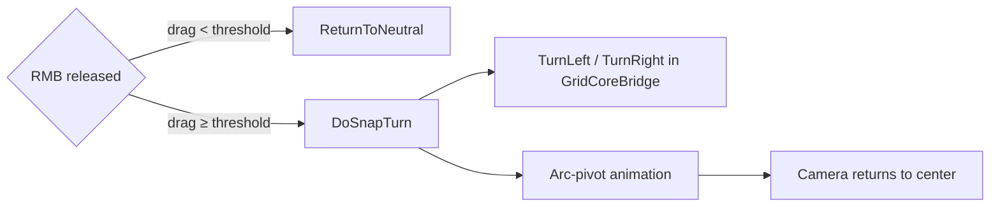

# Party Look

`PartyLook` adds **right-mouse free-look** to the party camera. Hold the right mouse button to pan and tilt the view freely within configurable limits. Release to snap back to center — or, if you dragged far enough horizontally, to trigger an automatic **90° snap turn** that actually rotates the party and updates the grid.

Requires `PartyVisuals` on the same GameObject.

---

## Setup

1. Select the **party root** (the GameObject with `PartyVisuals`).
2. **Add Component → Party Look.**
3. Adjust sensitivity and angle limits in the Inspector.

The component auto-detects the child `Camera` transform. No wiring needed.

---

## Inspector reference

### Look Settings

| Field | Default | What it does |
|---|---|---|
| **Look Sensitivity** | 0.12 | How many degrees the camera rotates per pixel of mouse drag. Higher = snappier. |
| **Max Vertical Angle** | 30° | Maximum up/down tilt. |
| **Max Horizontal Angle** | 80° | Maximum left/right pan before a snap-turn takes over (see below). |
| **Return Time** | 0.2 s | How long the camera takes to ease back to center after releasing RMB. |

### Snap Turn

| Field | Default | What it does |
|---|---|---|
| **Snap Turn Threshold** | 30 px | Horizontal drag distance (in screen pixels) that triggers an automatic 90° turn instead of a free-look return. |
| **Snap Turn Curve** | EaseInOut | Easing for the snap-turn animation. |
| **Return Curve** | EaseInOut | Easing for the return-to-center animation. |

---

## How it works

### Free-look

While the right mouse button is held, `PartyLook` offsets the camera's `localRotation` using the raw pixel delta from the start of the drag:

```
rotation.x = -deltaY * sensitivity   (clamped to ±maxVerticalAngle)
rotation.y =  deltaX * sensitivity   (clamped to ±maxHorizontalAngle)
```

The cursor is hidden during free-look and restored on release. Free-look is suppressed while the party is animating or an animation is playing, and when the pointer is over a UI element.

### On release — return or snap

When RMB is released, `PartyLook` checks the accumulated horizontal drag:

- **|rotation.y| < snapTurnThreshold** → `ReturnToNeutral`: the camera eases back to `Quaternion.identity` over `returnTime` seconds.
- **|rotation.y| ≥ snapTurnThreshold** → `DoSnapTurn`: the component calls `TurnRight()` or `TurnLeft()` on `GridCoreBridge`, cancels `PartyVisuals`'s pending turn animation, and plays its own smooth arc-pivot that simultaneously rotates the party root and sweeps the camera to neutral.



### Snap-turn arc pivot

The snap-turn is more than a simple lerp. The camera position is swept along an **arc around the party root**:

1. Record the world position and rotation of the camera at the moment RMB is released.
2. Rotate the camera position around the party root pivot by the turn angle over `returnTime`.
3. Simultaneously slerp the camera rotation from its current free-look orientation to the new neutral (post-turn) forward.

This prevents the camera from cutting through geometry and keeps the view centred on the pivot point.

---

## Interaction with other components

| Component | Interaction |
|---|---|
| `PartyVisuals` | `PartyLook` calls `CancelCurrentAnimation()` at the start of a snap-turn to prevent two conflicting rotation coroutines running at once. |
| `PartyInputHandler` | No direct coupling. Both read from the same `GridCoreBridge`, so a snap-turn from `PartyLook` registers as a normal turn for input purposes. |
| `PartyBobbing` | No coupling. Both use `LateUpdate`; bobbing applies only during `IsAnimating` which is `false` during snap-turn. |
| `EventSystem` | Free-look is suppressed when `EventSystem.IsPointerOverGameObject()` is true, so UI clicks don't start a look drag. |

---

## Troubleshooting

??? failure "Right-click free-look doesn't work"
    Check that `PartyLook` is on the same GameObject as `PartyVisuals` and that a Camera exists in the children. The component logs nothing when disabled; if it's inactive, the camera `GetComponentInChildren<Camera>()` returned `null`.

??? failure "Snap-turn fires when I just wanted to look"
    Lower **Snap Turn Threshold** is more aggressive; raise it to require a longer drag. The default (30 px) works well at 1080p; on high-DPI displays you may want to increase it.

??? failure "Camera snaps to a wrong angle after a snap-turn"
    Make sure only one `PartyLook` is in the scene. If `PartyVisuals` is also playing a turn animation simultaneously, `CancelCurrentAnimation()` stops it — but if you have a custom component that also drives the party root rotation, they will fight. Use Script Execution Order to ensure `PartyLook` runs after any other rotation writers.

??? failure "Cursor stays hidden after releasing RMB"
    `isFreeLooking` is set to `false` and `Cursor.visible = true` in the same frame RMB is released. If the game loses focus mid-drag, the flag can get stuck. Add a fallback in your pause/unfocus handler: `Cursor.visible = true`.

---

*CrawlerKIT — Mantis3de*
