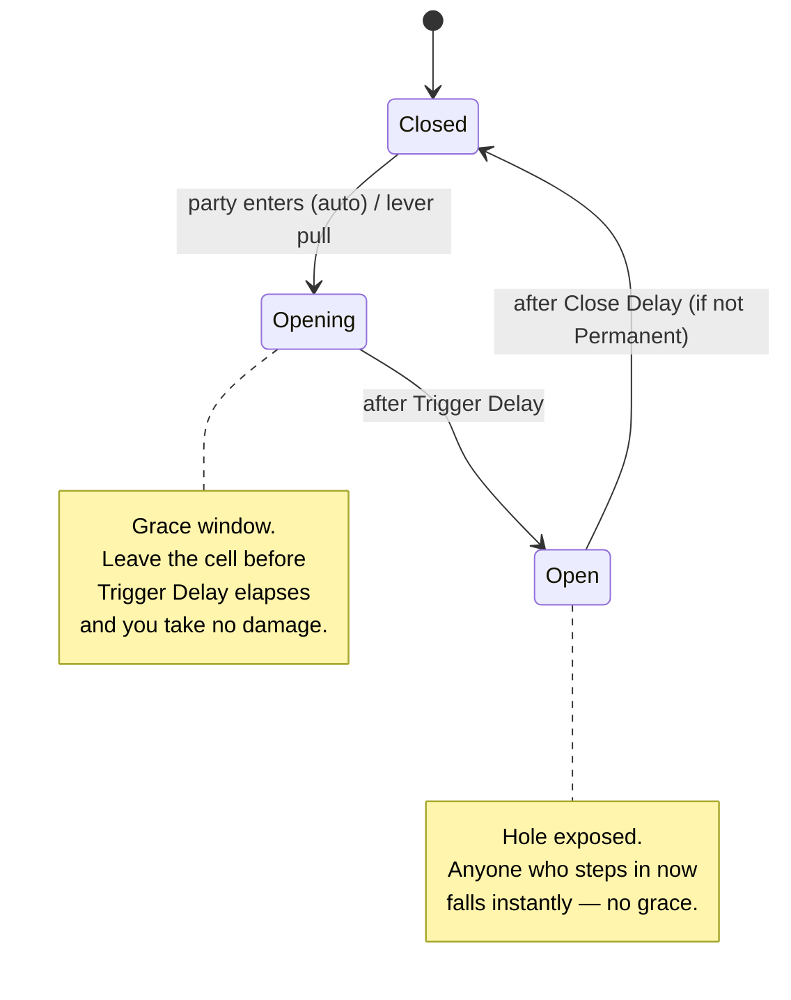

# Setup Guide — Pit & Trapdoor

Every hole in the floor — a plain open pit or an animated trapdoor — uses the same **TrapDoor** cell type. The difference is whether you attach a `TrapDoorTrap` component:

| Variant | Cell type | Component | Behaviour |
|---|---|---|---|
| Plain pit | TrapDoor | none | Party walks in and falls immediately |
| Trap pit | TrapDoor | `TrapDoorTrap` | Full mechanics: delay, animation, lever, reset, custom damage |

---

## How the timing works

A `TrapDoorTrap` cell is always in one of two states, and that state decides what happens when the party steps on it:



**Closed → Opening (the grace window).** When the party steps onto a *closed* plate, the trap waits **Trigger Delay** seconds before the hole actually opens. If the party walks off the cell during that window, the hatch opens onto empty air and nobody is hurt. This is the "run across before it drops" plate. Set **Trigger Delay = 0** instead and there is no window — the party falls the instant they step on, i.e. a classic hidden pit.

**Open → instant fall.** Once the hole is open, the grace window is gone. Anyone stepping onto an open hole falls immediately, in both auto and lever modes.

!!! info "The hole only kills if you're standing on it when it opens"
    Damage is applied at the moment the hatch opens (and on every later entry while it stays open) — *only if the party is actually on the cell at that instant*. This is why the cell no longer kills you the moment you enter; the `TrapDoorTrap` component owns the timing, not the grid.

---

## Step 1 — Mark the cell in the Dungeon Generator

In the **Spawn Tools** panel, click the orange **Trap Door** button. This places a floor cell with `cellType = TrapDoor` at the origin — move it to the correct position. Alternatively, select an existing floor flag and change its **Cell Type** to `TrapDoor` in the Inspector.

After placing all cells, click **Generate Unique IDs (all traps)**, then **Build Grid (Export JSON)**.

!!! note "No more Pit cell type"
    The old **Pit** cell type (impassable, decorative) is no longer used. All holes in the floor use **TrapDoor**. A plain pit without a `TrapDoorTrap` component behaves identically to the old Pit — the party can enter and falls — while still letting you add trap mechanics later by simply attaching the component.

---

## Step 2 — Prefab hierarchy

### Plain pit (no component)

Place the pit mesh at the cell. No `TrapMarker` or `TrapDoorTrap` needed. The party walks in and falls. Done.

### Trap pit (with component)

```
TrapDoor              ← root: TrapMarker + TrapDoorTrap
└── TrapMesh          ← hatch geometry + Animator (optional)
```

Add **both** `TrapMarker` and `TrapDoorTrap` to the root GameObject.

**`TrapMarker`** — required. Stores the `trapId` and registers the trap in the JSON export. Without it the trap state won't be saved.

**`TrapDoorTrap`** — the actual trap logic (delay, damage, animation, events).

On **TrapMesh** (child) — an `Animator` with open/close clips. If you don't want animation, leave `TrapMesh` without an Animator.

---

## Step 3 — Configure TrapDoorTrap

### Section: Auto-Trigger on Cell Enter

| Field | Default | What it does |
|---|---|---|
| **Auto Trigger On Enter** | ✅ | The trap fires on its own when the party steps onto the cell. Disable for lever-controlled traps. |
| **Require Party On Cell On External Trigger** | ✅ | Lever mode only. The lever fires the trap **only if the party is already standing on the cell**. Disable to let the lever open the hatch regardless of where the party is. |
| **Trigger Delay** | 0 s | Seconds between stepping onto the cell and the hatch opening. `0` = instant. `0.3–0.5 s` works well with an opening animation. |

### Section: Behaviour

| Field | Default | What it does |
|---|---|---|
| **Permanent** | ✅ | The pit stays open forever after firing. Disable if the trap should close and reset after a delay. |
| **Close Delay** | 2 s | Seconds the trap waits open before closing. **Ignored while Permanent is on.** |
| **Trigger Once** | ✅ | After the first trigger, ignore all subsequent enters and external triggers. Disable for a repeating trap. |

!!! warning "These three fields depend on each other — a common gotcha"
    They are easy to mis-set because one silently overrides another:

    - **Close Delay does nothing while Permanent is on.** A permanent pit never closes, no matter what Close Delay says. To make the hatch close again, turn **Permanent off**.
    - **A closed trap won't re-open while Trigger Once is on.** After it closes it stays "used up" and ignores the next entry. For a trap that re-arms every time, turn **Trigger Once off**.

    | You want… | Permanent | Trigger Once |
    |---|---|---|
    | One-shot pit, stays open | ✅ on | ✅ on |
    | Closes once, then dead | ❌ off | ✅ on |
    | Closes and re-arms every time | ❌ off | ❌ off |

### Section: Fall Damage

| Field | Default | What it does |
|---|---|---|
| **Damage Preset** | InstantKill | `InstantKill` kills everyone immediately. `Heavy` deals 50. `Light` deals 20. `Custom` uses the value below. |
| **Fall Damage** | 20 | Damage value when Damage Preset is set to `Custom`. |

### Section: Animator

Fill these in only if you have an animated hatch. Leave them empty for a pit that is always open.

| Field | What to put |
|---|---|
| **Trap Animator** | Drag the `Animator` component from `TrapMesh` here |
| **Open Trigger** | The Animator trigger name that opens the hatch. Default: `Open` |
| **Close Trigger** | The Animator trigger name that closes the hatch. Default: `Close`. Used only when **Permanent = false** or a lever closes the hatch. |

### Section: Events

| Event | When it fires |
|---|---|
| **On Fall Triggered** | Just before damage is applied — the party is falling. Wire in a sound, camera shake, or cutscene here. |
| **On Trap Closed** | When the hatch closes (only when **Permanent = false** or lever-close). |

---

## Step 4 — Animator setup (detailed)

If the hatch should visually open and close, you need an Animator on `TrapMesh`.

### States

Create the following states in the Animator Controller:

```
Idle_Closed     ← default state (right-click → Set as Layer Default State)
                  hatch looks like a normal floor tile
Opening         ← hatch swings open
Idle_Open       ← hatch is open, pit is visible
Closing         ← hatch swings shut (only needed when Permanent = false or lever closes it)
```

### Parameters

In the **Parameters** tab of the Animator, add two triggers:

| Name | Type |
|---|---|
| `Open` | Trigger |
| `Close` | Trigger |

(If you changed the names in the `TrapDoorTrap` Inspector fields, use exactly those names here.)

### Transitions

**Idle_Closed → Opening**

- Condition: trigger `Open`
- **Has Exit Time**: ❌ off
- **Transition Duration**: 0

**Opening → Idle_Open**

- **Has Exit Time**: ✅ on (transitions automatically when the clip ends)
- No condition

**Idle_Open → Closing** *(only if the hatch can close)*

- Condition: trigger `Close`
- **Has Exit Time**: ❌ off
- **Transition Duration**: 0

**Closing → Idle_Closed** *(only if the hatch can close)*

- **Has Exit Time**: ✅ on
- No condition

!!! tip "Permanent trap — no Closing state needed"
    If the hatch is permanent (never closes), you only need `Idle_Closed`, `Opening`, `Idle_Open` and the `Open` trigger. Skip `Closing` and the `Close` trigger entirely.

---

## Variant A — Auto trap (party steps in, falls)

The classic hidden pit: the party steps on the cell, after a short delay the hatch drops.

| Field | Value |
|---|---|
| Auto Trigger On Enter | ✅ |
| Trigger Delay | `0` *(no escape — keep it low; any delay becomes a grace window the party can cross)* |
| Damage Preset | InstantKill |
| Permanent | ✅ |
| Trigger Once | ✅ |
| Trap Animator | Animator from TrapMesh |
| Open Trigger | `Open` |
| Close Trigger | *(leave empty)* |

No lever needed. Setup complete.

!!! tip "Hidden pit vs. timed plate"
    Keep **Trigger Delay** small (or `0`) for a *hidden pit* the party can't escape. Raise it (e.g. `1 s`) and turn off Permanent/Trigger Once to get the *timed plate* in Variant C — a hole the party can sprint across before it drops.

---

## Variant C — Timed plate (cross before it opens, then it re-arms)

A plate over a hole. Step on it and a timer starts; cross to the next cell before the timer ends and you make it. Too slow and the hatch drops under you. After it has been open for a while it closes again, ready for the next attempt.

| Field | Value |
|---|---|
| Auto Trigger On Enter | ✅ |
| Trigger Delay | `1 s` *(your window to cross)* |
| Permanent | ❌ *(so it can close)* |
| Close Delay | `2 s` *(how long the hole stays open)* |
| Trigger Once | ❌ *(so it re-arms for the next run)* |
| Damage Preset | InstantKill *(or Heavy/Light for a survivable fall)* |
| Trap Animator | Animator from TrapMesh |
| Open Trigger | `Open` |
| Close Trigger | `Close` |

Full cycle: step on → **1 s** grace to walk off → hatch opens (you fall if still on it) → stays open **2 s** (anyone stepping in falls instantly) → closes and re-arms.

!!! note "Needs the Closing animation"
    Because Permanent is off, the Animator must include `Idle_Open → Closing → Idle_Closed` and the `Close` trigger (see Step 4). Without it the trap closes in code but the hatch stays visually open.

---

## Variant B — Lever-controlled hatch (toggle: opens and closes)

First lever pull opens the hatch. Second pull closes it again.

### TrapDoorTrap fields

| Field | Value |
|---|---|
| Auto Trigger On Enter | ❌ |
| Require Party On Cell On External Trigger | ✅ *(lever only works if party is standing on the hatch)* or ❌ *(lever works from anywhere)* |
| Trigger Delay | 0.2 s |
| Damage Preset | InstantKill |
| Permanent | ✅ |
| Trap Animator | Animator from TrapMesh |
| Open Trigger | `Open` |
| Close Trigger | `Close` |

### Connecting the lever

1. Select the GameObject with `WallLever`.
2. In the Inspector, find the **Targets** list.
3. Click **+** and drag the GameObject with `TrapDoorTrap` into the slot.

First pull → lever activates → `OnTriggered` → hatch opens (`Open` trigger fired).  
Second pull → lever deactivates → `OnReleased` → hatch closes (`Close` trigger fired).

!!! warning "Animator needs the Closing state"
    For lever-close to show animation the Animator must have `Idle_Open → Closing → Idle_Closed` and the `Close` trigger. Without it the hatch closes in code but you won't see the animation.

---

## Troubleshooting

??? failure "It kills me the instant I step on, even with a Trigger Delay set"
    The grace window only exists when the `TrapDoorTrap` component owns the cell. The component claims its cell on `Start()` so the grid stops instant-killing on enter — make sure the `TrapDoorTrap` (and its required `TrapMarker`) are actually on the cell and active. A `TrapDoor` cell with **no** `TrapDoorTrap` is a plain pit and always kills on enter by design.

??? failure "I set a Close Delay but it never closes"
    **Permanent** is on. Close Delay is ignored while Permanent is on. Turn Permanent **off**.

??? failure "It closes, but stepping on it again does nothing"
    **Trigger Once** is on, so after closing it stays used-up and ignores the next entry. Turn Trigger Once **off** to re-arm it every time.

??? failure "Stepping onto the already-open hole doesn't make me fall"
    Update to the current `TrapDoorTrap` — an open hole now applies the fall on entry in both auto and lever modes. If it still doesn't, confirm the trap actually reached the Open state (check that the open animation/`OnFallTriggered` fired).

??? failure "It closes in code but the hatch stays open on screen"
    Animator issue, not logic. You need the `Idle_Open → Closing → Idle_Closed` states and the `Close` trigger (Step 4). The state resets internally regardless; only the visual is missing.

---

## Summary — what goes where

| GameObject | Components |
|---|---|
| `TrapDoor` (root) | `TrapMarker` *(required)*, `TrapDoorTrap` *(optional)* |
| `TrapMesh` (child) | `Animator` *(optional — only for animated hatch)* |

The cell at the same grid position must have `cellType = TrapDoor` and be exported to the JSON.

---

*CrawlerKIT — Mantis3de*
